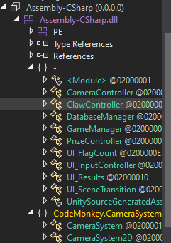
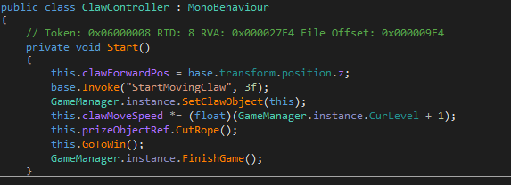
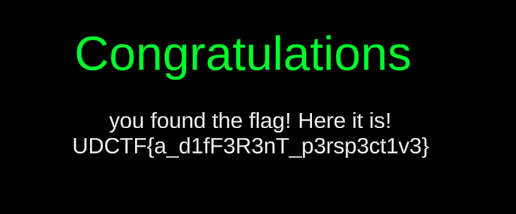

In this challenge, we are given a game built in Unity Game Engine. In order to get the flag, we need to beat the game.
Unfortunately, the game is too hard to beat, so we will need to be more creative to capture the flag.

## Decompile

After unzipping the game, we can see a bunch of DLL files. We can decompile these to view the game's source code.
**The file we are interested in decompiling is the `CutTheString_Data/Managed/Assembly-CSharp.dll`.**
This file contains the source code that the creator wrote to control game logic.

We will be using [dnSpy](https://github.com/dnSpy/dnSpy/releases) as a tool to compile/decompile these files. 

## Alter Code

After opening the code in dnSpy, we can see the different C# classes the creator has to control the game.

There are many different ways we could alter the code to benefit us.
One easy way I found was to edit the `ClawController` class. 

As you can see, I added a few lines of code in the `Start()` method. The lines that I added are:
- `this.prizeObjectRef.CutRope();`
- `this.GoToWin();`
- `GameManager.instance.FinishGame();`

This just uses the built in methods created by the author to make us win the game immediately. 

## Compile and Replace

Now that we have edited the code, we need to replace the original `Assembly-CSharp.dll` with ours.
We can use File->Save Module in dnSpy to compile our `Assembly-CSharp.dll`. 
We then need to replace the file in `CutTheString_Data/Managed`. It is a good idea to move the original file
elsewhere in case we will need it. 

## "Play" the Game
If we relaunch the game's executable, we will win automatically after our code executes. 

