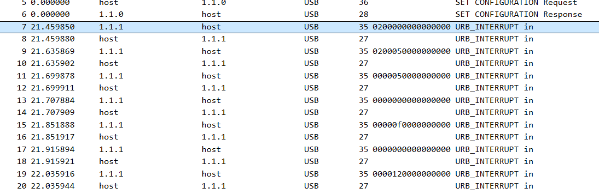
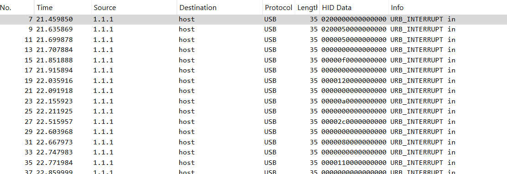
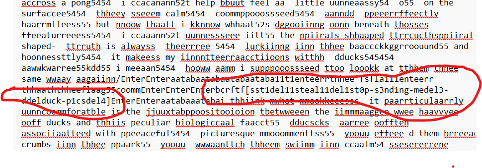

<h1>Forensics</h1>
<h2>duck_picks</h2>

[duck.pcapng](_chall_files%2Fduck.pcapng)

Opening the pcapng file in wireshark, it appears to be full of USB traffic.

I noticed that the response packets have some HID data and after some googling learned that this type of resonance comes from USB devices like keyboards, mice, and game controllers.

Based on how the Hex values looked I assumed it was keyboard data. Looking back I see that the Configuration response also included that the interface was a keyboard.

If we filter the packets to only include ones that contain HID data and extract them to a txt file we end up with a long list of hex values.

I then wrote a python script to convert the hex into regular characters using standard keyboard keys codes.

The decoded data shows the flag but the text is really messy and my simple script did not include shift or remove chars that have been backspaced(just printed “del”). So instead of being intelligent and improving my script I simply found the location where the flag started in the hex data and decoded it manually using a key code table. This revealed the flag to be.
bctf{SSteASt0p_s3nd1Ng_m3_DuCK_p1c$}

In hindsight I should have looked on the internet to find a complete script to decode the hex data instead of doing it myself. oops.
